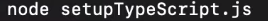
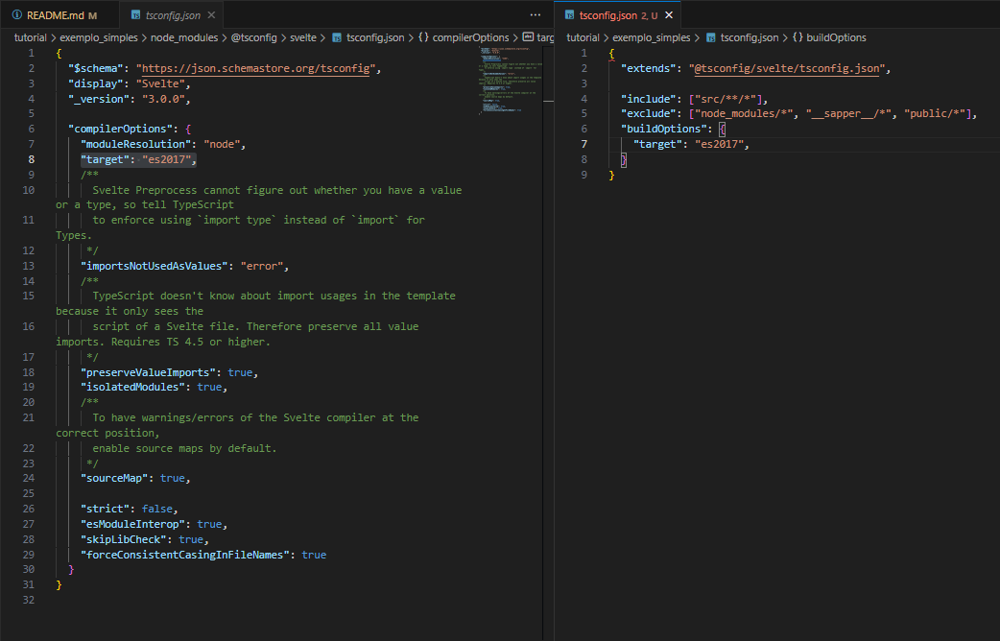
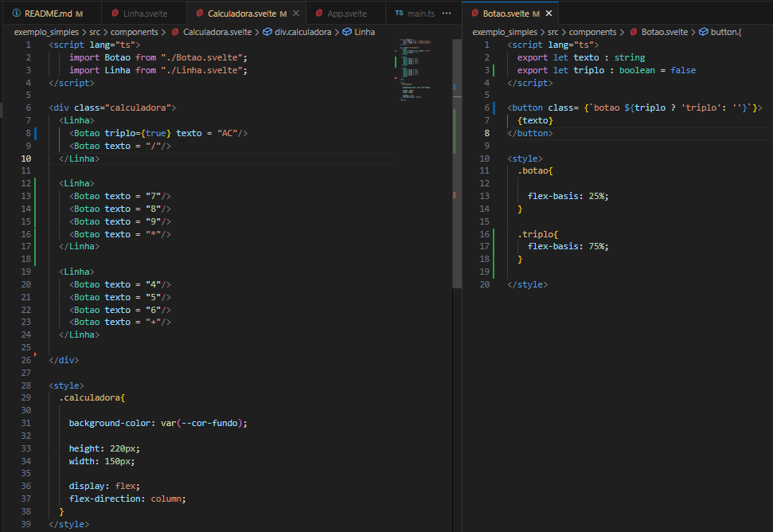
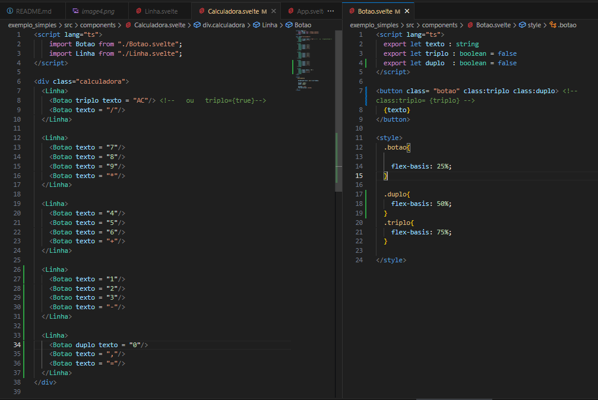

# Svelte é um compilador [docs](https://svelte.dev/)
#### vai compilar o meu código e transformar em um javaScript pura (Vanila Js) 
#### código sem dependências, e não usa DOM  virtual

### `npx degit sveltejs/template exemplo_simples`
### `cd exemplo_simples`
### extensão svelt for vs code id `svelte.svelte-vscode`
## Se quiser deixar setado para TypeScript 

### volte para pasta raiz do projeto e executa `npm i`
### dentro da pasta `node_modules/@tsconfig/svelte/ tsconfig.json`  copie a linha do target e cole dentro da pasta raiz do projeto dentro do campo buildOptions no tsconfig.json 

### agora execute da pasta raiz do projeto `npm run dev`

# Criando um componente
### é um arquivo do tipo .svelte que tem pradrozinado pedaço `script`  `<main>` `<style/>`
### e quando ele for usado como componente é o nome do arquivo que vai funcionar como se fosse uma tag html `<Nome_do_arquivo/>`
### como é possivel passar a propriedade para um componente botão ?

### dentro do arquivo `App.svelte` colocar componente dentro da tag html `<main> <main/>`
# Passando valor para o componente
### e se eu quiser passar valores para o componente pela propriedade , como faço isso ?
#### 1. cria a propriedade = criar uma variavel no pedaço script dentro do arquivo do componente
#### Qual tipo de dado desta propriedade ? vai depender se for um dado imutável  ou dado mutável ( const , let )
#### 2.                    = agora deixar a variavel visivel usando export  `export let variavel = ''` ou `export let variavel` neste é obrigado definir proriedade quando usar componente
#### Agora esta variavel que esta dentro do script do arquivo do componente pode ser usado como propriedade do componente , quando for usar o componente na pagina principal  `App.svelte`
#### 3. fazer o valor da variavel dentro do script aparecer no html . Basta somente colocar o nome da variável entre chaves dentro da tag html `{variavel}` . isso é o mesmo que interpolar variavel

# Criando um componente composto
### usar um componente menor (`Botao`) dentro de um componente maior(`Calculadora`)
### dentro do componente linha no seu html especificar que tera elementos filhos usando `<slot/>` 
### Dentro do componente `Calculadora` estruturei assim três componente `linha` que cada um vai agrupar componentes `Botao`
### Alguns botão quero que tenha o flex-basis diferente , o que eu devo fazer para atribuir propriedades de uma clase css  a um destes componentes `Botao` usando condicional ?
### usando  javaScript puro 

#### colocando so o nome da propriedade do componente ja é entendido como true

### usando svelte

##### https://svelte.dev/docs/element-directives#class-name 

# Criando componente `Tela`
##### o css deste componente vai ter `flex : 1` isso é ocupar o máximo de espaço que conseguir
##### diminuir o tamanho da fonte quando numero do display for maior
###### usar sintaxe do svelte `$:`[here](https://svelte.dev/docs/svelte-components#script-3-$-marks-a-statement-as-reactive) para mudar tamanho da fionte de acordo com tamanho do número

###### #se o tamanho do numero for maior que o tamanho que cabe no display aplicar uma classe, como valor dentro da variavel condicional, que muda o tamanho da fonte
###### #ajustar o tamanho da fonte de acordo com a quantidade de caracteres
###### #de acordo com o valor passado para propriedade quando usado o componente estarei adicionando uma classe diferente para mudar tamanho da fonte

#### 1. cria variavél no `script`
#### 2. põe lógica condicional classe na div `html`
#### 3. cria classe no `css`
###### 23 - 15' assisti 10' do tutorial
###### 24 - 30' pratiquei até 4'44" do tutorial
###### 24 - 50' pratiquei até 11" do tutorial
###### 25 - 50' assisti e pratiquei 10 do tutorial
###### 25 - 20' assisti 10' do tutorial
###### 26 - 50' pratiquei 10' do tutorial assistido ontem
###### 28 - 1h35' assisti e pratiquei 14' do tutorial

# parei 44:00
https://youtu.be/SVNTizLyuvo